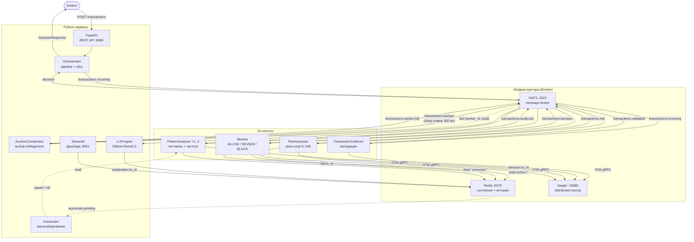

# Fraud Detection System — ЛР №13

Мультиагентная распределённая система обнаружения мошенничества.  
Вариант 26. Повышенная сложность.

---

## Архитектура



---

## Компоненты

### Go-агенты

| Агент | Тема (вход) | Тема (выход) | Задача |
|---|---|---|---|
| TransactionCollector | `transactions.incoming` | `transactions.validated` | Валидация полей, валюты, суммы, давности |
| PatternAnalyzer | `transactions.worker.{id}` | `transactions.analyzed` | Частота, отклонение суммы, время суток, large_amount |
| RiskAssessor | `transactions.analyzed` | `transactions.risk` | Взвешенный риск-скор (0–100): частота×0.3 + сумма×0.25 + паттерны×0.25 + гео×0.1 + время×0.1 |
| Blocker | `transactions.risk` | `transactions.decision` | ALLOW / REVIEW / BLOCK по порогам LOW/MEDIUM/HIGH/CRITICAL |

### Python-сервисы

| Сервис | Описание |
|---|---|
| **Orchestrator** | Отправляет транзакцию в pipeline, ждёт решение (timeout 30 с, retry ×3) |
| **AuctionCoordinator** | Перехватывает `transactions.validated`, проводит аукцион среди PatternAnalyzer-инстансов (300 мс), роутит победителю |
| **Autoscaler** | Мониторит `autoscale:pending` в Redis каждые 5 с; если > 5 — запускает доп. агентов (max +2), если < 2 — останавливает |
| **LLM Agent** | Подписывается на `transactions.decision`, генерирует объяснение через Ollama llama3.2, сохраняет в Redis |
| **Streamlit Dashboard** | Метрики ALLOW/BLOCK/REVIEW, таблица последних транзакций, LLM-объяснение по клику, статус autoscaler/auction |

### Инфраструктура

| Сервис | Порты | Описание |
|---|---|---|
| NATS | 4222, 8222 | Message broker (core NATS, QueueSubscribe) |
| Redis | 6379 | Состояние агентов, история, объяснения |
| Jaeger | 16686, 4317 | Distributed tracing (OTLP gRPC) |

---

## Быстрый старт

### Требования

- Go 1.26+
- Python 3.11+
- Docker + Docker Compose
- Ollama (установлен через `brew install ollama`)

### Запуск

```bash
# 1. Инфраструктура
make run-infra

# 2. Собрать и запустить Go-агентов
make run-agents

# 3. REST API
make run-api          # http://localhost:8080/docs

# 4. Координатор аукциона (отдельный терминал)
make run-auction

# 5. Автоскейлер (отдельный терминал)
make run-autoscaler

# 6. LLM-агент (отдельный терминал)
make run-llm

# 7. Дашборд (отдельный терминал)
make run-dashboard    # http://localhost:8501
```

### Тесты

```bash
make test             # Go + Python
make test-go          # только Go
make test-py          # только Python (pytest)
```

---

## API

| Метод | Путь | Описание |
|---|---|---|
| `POST` | `/transactions` | Отправить транзакцию на проверку |
| `GET` | `/transactions/{id}` | Получить решение по ID |
| `GET` | `/transactions/{id}/explanation` | LLM-объяснение решения |
| `GET` | `/stats` | Счётчики ALLOW / BLOCK / REVIEW |
| `GET` | `/autoscale` | Статус автомасштабирования |
| `GET` | `/health` | Health check |

### Пример запроса

```bash
curl -X POST http://localhost:8080/transactions \
  -H 'Content-Type: application/json' \
  -d '{"account_id":"acc-001","amount":15000,"currency":"USD","country_code":"NG"}'
```

```json
{
  "transaction_id": "550e8400-e29b-41d4-a716-446655440000",
  "account_id": "acc-001",
  "action": "BLOCK",
  "risk_score": 88.5,
  "risk_level": "CRITICAL",
  "reasons": ["large_amount", "critical_risk_score:88.5"],
  "timestamp": "2026-05-07T12:00:00Z"
}
```

---

## Мониторинг

| Инструмент | URL |
|---|---|
| Jaeger UI | http://localhost:16686 |
| NATS Monitoring | http://localhost:8222 |
| Streamlit Dashboard | http://localhost:8501 |
| FastAPI Swagger | http://localhost:8080/docs |

---

## Структура проекта

```
fraud-detection-system/
├── agents/
│   ├── shared/                  # общие типы и OTel-инициализация
│   ├── transaction_collector/   # Go-агент + тесты
│   ├── pattern_analyzer/        # Go-агент (аукцион: bid + worker inbox)
│   ├── risk_assessor/           # Go-агент + тесты
│   └── blocker/                 # Go-агент
├── orchestrator/
│   ├── api.py                   # FastAPI REST API
│   ├── orchestrator.py          # pipeline + pending-трекинг
│   ├── auction.py               # AuctionCoordinator
│   ├── autoscaler.py            # Autoscaler
│   ├── llm_agent.py             # LLM Agent (Ollama)
│   ├── dashboard.py             # Streamlit Dashboard
│   ├── models.py                # Transaction / Decision dataclasses
│   ├── test_models.py           # pytest
│   ├── test_llm_agent.py        # pytest
│   ├── test_autoscaler.py       # pytest
│   └── requirements.txt
├── docker-compose.yml           # NATS + Redis + Jaeger
├── Makefile
└── go.mod
```

---

## Выполненные задания

| № | Задание | Реализация | Статус |
|---|---------|------------|--------|
| 1 | **Система агентов на Go** | 4 микросервиса: TransactionCollector, PatternAnalyzer, RiskAssessor, Blocker — каждый отдельный бинарник, общение через NATS | ✅ |
| 2 | **Цепочки задач (pipeline)** | `incoming → validated → auction → worker.{id} → analyzed → risk → decision`; оркестратор на Python с retry ×3 и timeout 30 с | ✅ |
| 3 | **Распределённая трассировка (Jaeger)** | OpenTelemetry + OTLP gRPC во всех 4 агентах; дочерние spans для каждой проверки; Jaeger в Docker на `:16686` | ✅ |
| 4 | **Агент с состоянием (Redis)** | PatternAnalyzer хранит частоту транзакций (sorted set) и историю сумм (list); Blocker — историю блокировок; при перезапуске состояние восстанавливается | ✅ |
| 5 | **Динамическое масштабирование** | Autoscaler мониторит `autoscale:pending` в Redis каждые 5 с; при > 5 запускает доп. инстансы агентов (max +2), при < 2 — останавливает | ✅ |
| 6 | **Аукционное распределение задач** | AuctionCoordinator перехватывает validated-транзакции, собирает ставки от PatternAnalyzer-инстансов 300 мс, роутит победителю с минимальной нагрузкой | ✅ |
| 7 | **Интеграция LLM-агента** | Python-агент подписывается на решения, генерирует объяснение через Ollama llama3.2, сохраняет в Redis; доступно через `GET /transactions/{id}/explanation` | ✅ |
| 8 | **Веб-интерфейс мониторинга** | Streamlit Dashboard `:8501` — метрики ALLOW/BLOCK/REVIEW, таблица транзакций, LLM-объяснение по клику, статус autoscaler и аукциона, авто-обновление каждые 5 с | ✅ |

---

## Стек

`Go 1.26` · `Python 3.13` · `NATS` · `Redis` · `Jaeger/OTel` · `FastAPI` · `Streamlit` · `Ollama llama3.2`
